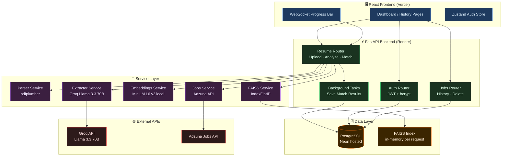
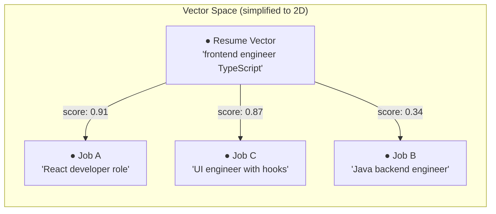
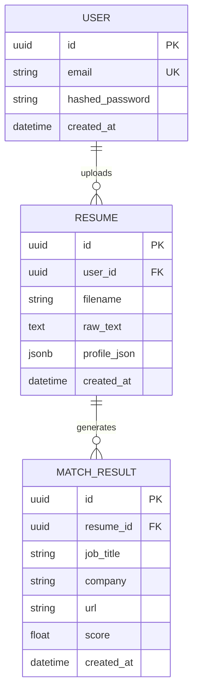

# ResumeRAG v2

### Semantic resume-to-job matching using local embeddings, FAISS vector search, and Groq's Llama 3.3 70B — no keyword guessing, no black boxes.

[](https://fastapi.tiangolo.com)
[](https://react.dev)
[](https://python.org)
[](LICENSE)
[]()


*Upload a resume, get semantically ranked job matches in seconds*

[🚀 Live Demo](https://your-vercel-url.vercel.app) &nbsp;&nbsp; [📖 API Docs](https://your-render-url/docs)

---

## Table of Contents

- [What It Does](#what-it-does)
- [System Architecture](#system-architecture)
- [Data Pipeline](#data-pipeline)
- [Semantic Matching Explained](#semantic-matching-explained)
- [Database Schema](#database-schema)
- [API Reference](#api-reference)
- [Project Structure](#project-structure)
- [Tech Stack Decisions](#tech-stack-decisions)
- [Local Setup](#local-setup)
- [Challenges & Learnings](#challenges--learnings)
- [What I'd Build Next](#what-id-build-next)
- [Contributing](#contributing)
- [License](#license)

---

## What It Does

Job boards match resumes to listings by counting shared keywords. If your resume says "React" and the job says "ReactJS", that's a miss — even though they mean the same thing. ResumeRAG v2 solves this by working in semantic space: both the resume and each job listing are converted to dense vector embeddings, and similarity is measured by the angle between vectors, not overlapping words.

The pipeline is fully automated. A user uploads a PDF, Groq's Llama 3.3 70B extracts a structured profile in under a second, MiniLM generates 384-dimensional embeddings locally (no data leaves the server), and FAISS ranks twenty real Adzuna job listings by cosine similarity. The result is a scored, sorted list of genuine matches — not keyword coincidences.

| Feature | Description | Tech Used |
|---|---|---|
| PDF Resume Parsing | Extracts raw text with magic byte validation — rejects non-PDFs regardless of extension | pdfplumber, custom validator |
| AI Profile Extraction | Structures skills, titles, experience years, and summary from unformatted resume text | Groq Llama 3.3 70B |
| Local Semantic Embeddings | Converts text to 384-dim vectors — no API cost, no data leaves the server | sentence-transformers MiniLM L6 v2 |
| Vector Job Ranking | Ranks 20 real listings by cosine similarity to resume embedding | FAISS IndexFlatIP |
| Real-Time Progress | WebSocket-driven step-by-step progress bar during the match pipeline | FastAPI WebSocket |
| Match History | Paginated, filterable, sortable history of all past match sessions | PostgreSQL + SQLAlchemy |
| Authentication | JWT access tokens (15 min) and refresh tokens (7 days), bcrypt passwords | python-jose, passlib |
| Rate Limiting | 10 match requests per hour per IP to protect API quotas | SlowAPI |

---

## System Architecture



All business logic is isolated in `services/`. Routers handle HTTP parsing and response shaping only — they contain no logic beyond calling a service function and returning its result.

---

## Data Pipeline

```mermaid
flowchart LR
  A["📄 PDF Upload\nbinary bytes"]
  --> B["Magic Byte Check\n%PDF header"]
  --> C["pdfplumber\nraw text string"]
  --> D["Groq Llama 3.3 70B\nstructured JSON profile"]
  --> E["Top 3 Skills\nAdzuna query"]
  --> F["20 Job Listings\nnormalized JSON"]
  --> G["MiniLM Encoder\n384-dim float32 vectors"]
  --> H["FAISS IndexFlatIP\nInner Product Search"]
  --> I["Ranked Matches\n0–100% scores"]
  --> J["PostgreSQL\nsaved to match_results"]
```



| Stage | Input | Output | Tool |
|---|---|---|---|
| PDF Upload | Binary bytes | Validated or rejected | `file_validator.py` |
| PDF Parse | Bytes buffer | Raw string ~3000 chars | pdfplumber |
| Profile Extract | Raw resume string | `{ skills[], experience_years, job_titles[], summary }` | Groq Llama 3.3 70B |
| Job Fetch | `skills[0:3]` joined as query | 20 normalized job dicts | Adzuna API |
| Embed Resume | Summary string | `float32[384]` normalized | MiniLM L6 v2 |
| Embed Jobs | 20 description strings | `float32[20][384]` normalized | MiniLM L6 v2 |
| FAISS Query | Query vector + index | 20 `(idx, score)` tuples | faiss-cpu |
| Save Results | Matches list | `MatchResult` rows persisted | SQLAlchemy BackgroundTask |

The HTTP response is returned to the client before the database write happens. `BackgroundTasks` handles persistence asynchronously — the user sees their results immediately.

---

## Semantic Matching Explained

Keyword-based matching fails because language is ambiguous. "React developer," "ReactJS engineer," and "frontend engineer with hooks experience" all describe the same candidate — but a string matcher treats them as three different things. The same problem appears with "ML" vs "machine learning," "k8s" vs "Kubernetes," or any abbreviation, synonym, or rephrasing.

Vector embeddings solve this by mapping text into a high-dimensional space where semantic proximity equals geometric proximity. MiniLM L6 v2 produces 384-dimensional vectors — every resume summary and every job description becomes a point in that space. A resume about TypeScript frontends lands near job descriptions about React roles, not near backend Rust positions, even if they share zero words in common.

The similarity metric is inner product search via `faiss.IndexFlatIP`. When all vectors are L2-normalized (enforced by `normalize_embeddings=True` in the encoder), inner product equals cosine similarity exactly. Cosine similarity is the cosine of the angle between two vectors — 1.0 means identical direction, 0.0 means orthogonal. Multiplied by 100, this becomes the percentage score shown in the UI.



*High score = semantic closeness, not shared vocabulary*

---

## Database Schema



`profile_json` stores the Groq-extracted profile as JSONB — flexible schema, indexed, queryable. `score` on `MatchResult` is the raw cosine similarity × 100 (float, 0–100). Cascade deletes are set on both FK relationships: deleting a user removes their resumes; deleting a resume removes its match results.

---

## API Reference

| Method | Endpoint | Auth | Rate Limit | Request Body | Response |
|---|---|---|---|---|---|
| `GET` | `/health` | None | None | — | `{ status, timestamp, version }` |
| `POST` | `/auth/signup` | None | None | `{ email, password }` | `{ access_token, refresh_token, token_type }` |
| `POST` | `/auth/login` | None | None | `{ email, password }` | `{ access_token, refresh_token, token_type }` |
| `POST` | `/resume/upload` | JWT | None | `multipart/form-data: file` | `{ resume_id, char_count }` |
| `POST` | `/resume/analyze` | JWT | None | `{ resume_id }` | `{ skills, experience_years, job_titles, summary }` |
| `POST` | `/resume/match` | JWT | 10/hour | `{ resume_id }` | `{ profile, matches[] }` |
| `GET` | `/matches` | JWT | None | `?page&limit&min_score&sort` | `{ total, page, limit, results[] }` |
| `DELETE` | `/matches/{id}` | JWT | None | — | `204 No Content` |

### Query Parameters — `GET /matches`

| Param | Type | Default | Constraints | Description |
|---|---|---|---|---|
| `page` | int | `1` | `>= 1` | Page number (1-indexed) |
| `limit` | int | `10` | `1–50` | Results per page |
| `min_score` | float | `0.0` | `0.0–100.0` | Minimum similarity score filter |
| `sort` | string | `score_desc` | `score_desc \| score_asc \| date_desc` | Sort order |

<details>
<summary>Example: POST /resume/match response</summary>

```json
{
  "profile": {
    "skills": ["React", "TypeScript", "Node.js"],
    "experience_years": 2,
    "job_titles": ["Frontend Developer"],
    "summary": "Frontend developer with 2 years building production React applications with TypeScript."
  },
  "matches": [
    {
      "title": "React Developer",
      "company": "Acme Corp",
      "location": "Remote, US",
      "url": "https://www.adzuna.com/details/...",
      "description": "We are looking for a React developer...",
      "score": 91.3,
      "salary_min": 50000,
      "salary_max": 80000
    },
    {
      "title": "Frontend Engineer",
      "company": "Startup Ltd",
      "location": "New York, NY",
      "url": "https://www.adzuna.com/details/...",
      "description": "Join our team building...",
      "score": 84.7,
      "salary_min": null,
      "salary_max": null
    }
  ]
}
```
</details>

<details>
<summary>Error response shape</summary>

All error responses follow a consistent structure:

```json
{
  "detail": "Human-readable error message"
}
```

Common status codes: `400` bad request, `401` unauthorized, `403` forbidden, `404` not found, `413` file too large, `422` validation error, `429` rate limit exceeded, `502` upstream API failure.
</details>

---

## Project Structure

```
backend/
├── routers/
│   ├── auth.py               # POST /auth/signup, /auth/login — delegates to auth_service
│   ├── resume.py             # POST /resume/upload, /analyze, /match — full AI pipeline
│   └── jobs.py               # GET /matches (paginated), DELETE /matches/{id}
├── models/
│   ├── __init__.py           # Imports all models so Alembic can discover them
│   ├── user.py               # SQLAlchemy User ORM — UUID pk, unique email, bcrypt hash
│   ├── resume.py             # SQLAlchemy Resume ORM — raw_text TEXT, profile_json JSONB
│   └── match_result.py       # SQLAlchemy MatchResult ORM — job_title, company, url, score
├── schemas/
│   ├── auth.py               # Pydantic: SignupRequest, LoginRequest, TokenResponse, UserOut
│   ├── resume.py             # Pydantic: ResumeIDRequest, UploadResponse, ProfileOut, MatchJobOut
│   └── match.py              # Pydantic: MatchResultOut, PaginatedMatchResponse
├── services/
│   ├── auth_service.py       # hash_password, verify_password, create_user, authenticate_user
│   ├── parser_service.py     # parse_pdf: pdfplumber → cleaned raw string, raises on <100 chars
│   ├── extractor_service.py  # extract_profile: Groq Llama 3.3 70B → validated profile dict
│   ├── embeddings_service.py # Module-level MiniLM load; embed_text → (384,), embed_batch → (N,384)
│   ├── faiss_service.py      # build_index: IndexFlatIP; query_index → [(idx, score)] sorted desc
│   └── jobs_service.py       # fetch_jobs: Adzuna GET → 20 normalized dicts, never raises
├── database/
│   └── db.py                 # Async engine (asyncpg), SessionLocal, Base, get_db dependency
├── middleware/
│   └── rate_limit.py         # SlowAPI limiter: 10/hr on /match, 100/hr default
├── utils/
│   ├── jwt.py                # create_access_token, create_refresh_token, verify_token, get_current_user
│   └── file_validator.py     # validate_pdf: magic byte check (%PDF) + 5MB size limit
├── background/
│   └── tasks.py              # save_match_results: sync Session bulk insert, called via BackgroundTasks
├── tests/
│   ├── conftest.py           # SQLite in-memory fixtures, AsyncClient, test_user factory
│   ├── test_auth.py          # 9 integration tests covering signup, login, JWT protection
│   └── test_resume.py        # Upload validation, magic bytes, rate limit (mocked pipeline)
├── main.py                   # FastAPI app, routers, CORS, SlowAPI, lifespan, /health, /ws/progress
├── .env.example              # All env vars with inline comments
└── requirements.txt          # Pinned versions for reproducible builds
```

```
frontend/
├── src/
│   ├── components/
│   │   ├── UploadZone.jsx    # react-dropzone PDF upload; idle / drag-active / selected states
│   │   ├── ProfileCard.jsx   # Extracted profile display; skills as tags, +N overflow
│   │   ├── JobCard.jsx       # Job match card; ScoreBadge top-right, hover lift animation
│   │   ├── SkeletonCard.jsx  # animate-pulse placeholder matching JobCard dimensions exactly
│   │   ├── ProgressBar.jsx   # WebSocket consumer; falls back to simulated timeline if WS fails
│   │   ├── ScoreBadge.jsx    # Green ≥80, yellow 60–79, grey <60; monospace pill
│   │   ├── Navbar.jsx        # Brand + nav links + user email + logout
│   │   └── ErrorBoundary.jsx # Class component; dev shows stack trace, prod shows reload button
│   ├── pages/
│   │   ├── Login.jsx         # Controlled inputs, no <form>, loading spinner, field errors
│   │   ├── Signup.jsx        # Password confirm validation, min 8 chars, field errors
│   │   ├── Dashboard.jsx     # State machine: idle → uploading → matching → complete
│   │   └── History.jsx       # Paginated matches; debounced search, score slider, sort dropdown
│   ├── hooks/
│   │   ├── useAuth.js        # login(), signup() — wraps auth service calls, sets Zustand state
│   │   ├── useResume.js      # upload(), match(), reset() — all resume pipeline API calls
│   │   └── useMatches.js     # fetch(), remove() — history pagination and deletion
│   ├── services/
│   │   ├── api.js            # Axios instance; auth interceptor, 401/429/5xx handlers
│   │   └── auth.service.js   # loginRequest, signupRequest — raw axios calls, called from hooks only
│   ├── store/
│   │   └── authStore.js      # Zustand + persist middleware; user, token, setAuth, logout
│   ├── layouts/
│   │   ├── AuthLayout.jsx    # Centered card on dark background for Login/Signup
│   │   └── AppLayout.jsx     # Protected wrapper; redirects if !token, renders Navbar
│   ├── App.jsx               # React Router route definitions
│   ├── main.jsx              # ReactDOM root, ErrorBoundary, BrowserRouter, Toaster
│   └── index.css             # Tailwind directives + JetBrains Mono font import
├── index.html                # Vite HTML entry point
├── vite.config.js            # React plugin + WS proxy to backend
├── tailwind.config.js        # Content paths + mono font + custom color tokens
└── package.json              # Dependencies pinned, dev/build/preview scripts
```

---

## Tech Stack Decisions

| Layer | Chose | Over | Why |
|---|---|---|---|
| Backend Framework | FastAPI | Flask | Async native — I/O-bound operations (Groq, Adzuna) await properly instead of blocking threads. Pydantic validation is the schema layer, not extra code. OpenAPI docs auto-generate from type hints. |
| AI Extraction | Groq (Llama 3.3 70B) | OpenAI GPT-4o | Sub-1-second inference on Groq's custom hardware. Profile extraction is a blocking step in a user-facing pipeline — every 100ms matters. GPT-4o adds 2–3 seconds of latency here. |
| Embeddings | sentence-transformers MiniLM (local) | OpenAI text-embedding-3-small | Zero cost per request, zero network latency, and resume content never leaves the server. The model loads once at startup (~2s), then embeds in ~200ms per batch. |
| Vector Search | FAISS IndexFlatIP | pgvector | 20 vectors per request don't justify the overhead of a DB extension, connection pool round-trips, and persistent storage. FAISS builds and queries an in-memory index in under 1ms. |
| Background Jobs | FastAPI BackgroundTasks | Celery + Redis | No Redis infrastructure, no worker process, no separate deploy. BackgroundTasks runs in the same process after the response — correct tool for fire-and-forget DB writes at this scale. |
| Frontend State | Zustand | Redux Toolkit | Auth state + two async data slices don't justify Redux's boilerplate. Zustand's `persist` middleware handles localStorage in one line. `isAuthenticated` is a computed getter — can't drift out of sync. |
| PDF Parsing | pdfplumber | PyPDF2 | pdfplumber correctly handles multi-column layouts, tables, and inconsistent spacing common in real-world resume PDFs. PyPDF2 mangles whitespace on complex layouts. |

---

## Local Setup

### Prerequisites

- Python 3.11+
- Node.js 18+
- PostgreSQL (or use [Neon](https://neon.tech) free tier)
- [Groq API key](https://console.groq.com) — free tier is sufficient
- [Adzuna API key](https://developer.adzuna.com) — free registration

### Option A: Docker (recommended)

```bash
git clone https://github.com/yourusername/resumerag-v2
cd resumerag-v2
cp backend/.env.example backend/.env
# Edit backend/.env with your API keys
docker-compose up --build
```

| Service | URL |
|---|---|
| Frontend | http://localhost:5173 |
| Backend | http://localhost:8000 |
| API Docs | http://localhost:8000/docs |

### Option B: Manual

```bash
# Backend
cd backend
python -m venv venv && source venv/bin/activate
pip install -r requirements.txt
cp .env.example .env
# Fill in .env with your keys
uvicorn main:app --reload --port 8000
```

```bash
# Frontend (new terminal)
cd frontend
npm install
cp .env.example .env.local
# Set VITE_API_URL=http://localhost:8000
npm run dev
```

### Run Tests

```bash
cd backend
pip install -r requirements-test.txt
pytest tests/ -v
# Runs 15 tests against an in-memory SQLite DB
# No real API keys needed — pipeline is mocked
```

### Environment Variables

| Variable | Required | Description | Where to get it |
|---|---|---|---|
| `DATABASE_URL` | Yes | PostgreSQL connection string | Your DB host, or [Neon](https://neon.tech) |
| `SECRET_KEY` | Yes | JWT signing secret | `openssl rand -hex 32` |
| `GROQ_API_KEY` | Yes | Groq inference API key | [console.groq.com](https://console.groq.com) |
| `ADZUNA_APP_ID` | Yes | Adzuna application ID | [developer.adzuna.com](https://developer.adzuna.com) |
| `ADZUNA_APP_KEY` | Yes | Adzuna API key | [developer.adzuna.com](https://developer.adzuna.com) |
| `ADZUNA_BASE_URL` | No | Adzuna base URL | Default: `https://api.adzuna.com/v1/api/jobs` |
| `ADZUNA_COUNTRY` | No | Job market country code | Default: `us`. Options: `gb`, `au`, `ca`, `de` |
| `FRONTEND_URL` | No | Frontend origin for CORS | Default: `http://localhost:5173` |

---

## Challenges & Learnings

### The FAISS normalization bug

The match pipeline was returning scores like 1.3, 1.7, even 2.1 — which is mathematically impossible for cosine similarity. I logged the raw FAISS output and traced back to the vectors themselves: the norms weren't 1.0. The sentence-transformer was returning unnormalized embeddings by default, so the inner product wasn't cosine similarity — it was an unscaled dot product that could exceed 1. Adding `normalize_embeddings=True` to `model.encode()` fixed it immediately. The lesson: always log and inspect intermediate values in ML pipelines before trusting the output shape. The math only works if your assumptions hold.

### Module-level model loading

The first implementation of the embeddings service loaded MiniLM inside the route handler function. Every match request took 4+ seconds just for model deserialization before a single embedding was computed. Moving the `SentenceTransformer(...)` call to module level — a single assignment at import time — dropped that overhead to a one-time 2-second startup cost, with subsequent requests taking ~200ms for a batch of 20. The lesson: understand your framework's import lifecycle. Python modules are singletons — an assignment at module scope runs exactly once per process, which is exactly the behavior needed for expensive stateful objects.

### WebSocket progress UX

The initial implementation of `/resume/match` just returned after 7–8 seconds with no intermediate feedback. In testing, users consistently thought the app had hung and refreshed the page. The fix was a FastAPI WebSocket endpoint that receives step updates from the pipeline and streams them to the browser in real time: "Parsing PDF → Extracting profile → Fetching jobs → Building index → Ranking." The lesson: perceived performance is as important as actual performance. A progress bar that shows activity — even if it doesn't reduce wall-clock time — makes an 8-second operation feel acceptable.

---

## What I'd Build Next

| Feature | Why | How |
|---|---|---|
| Redis embedding cache | The same three skills searched twice shouldn't re-embed 20 new jobs each time | Cache FAISS index keyed by sorted skill hash, TTL 1 hour |
| Recruiter mode | Flip the query — upload 100 candidate resumes, rank against one job description | Reverse embedding direction; batch-embed resumes, query with job vector |
| Resume versioning | Let users compare match scores across resume drafts | Add `version` integer + `parent_id` FK to `Resume` model |
| Streaming Groq output | Show profile extraction token by token rather than waiting for full JSON | Groq SDK streaming + SSE endpoint to frontend |
| pgvector migration | Persist embeddings across sessions — avoid re-embedding unchanged resumes | Replace per-request FAISS with pgvector on Neon; cache by resume hash |

---

## Contributing

1. Fork the repo and create a feature branch: `git checkout -b feat/your-feature`
2. Commit using conventional commits: `feat:`, `fix:`, `docs:`, `refactor:`
3. Push and open a pull request against `main`
4. PRs require passing tests (`pytest tests/ -v`) and no new linting errors

Please open an issue before starting significant work — it avoids duplicate effort and keeps the scope of PRs manageable.

---

## License

MIT License

Copyright (c) 2025

Permission is hereby granted, free of charge, to any person obtaining a copy of this software and associated documentation files (the "Software"), to deal in the Software without restriction, including without limitation the rights to use, copy, modify, merge, publish, distribute, sublicense, and/or sell copies of the Software, and to permit persons to whom the Software is furnished to do so, subject to the following conditions:

The above copyright notice and this permission notice shall be included in all copies or substantial portions of the Software.

THE SOFTWARE IS PROVIDED "AS IS", WITHOUT WARRANTY OF ANY KIND, EXPRESS OR IMPLIED, INCLUDING BUT NOT LIMITED TO THE WARRANTIES OF MERCHANTABILITY, FITNESS FOR A PARTICULAR PURPOSE AND NONINFRINGEMENT. IN NO EVENT SHALL THE AUTHORS OR COPYRIGHT HOLDERS BE LIABLE FOR ANY CLAIM, DAMAGES OR OTHER LIABILITY, WHETHER IN AN ACTION OF CONTRACT, TORT OR OTHERWISE, ARISING FROM, OUT OF OR IN CONNECTION WITH THE SOFTWARE OR THE USE OR OTHER DEALINGS IN THE SOFTWARE.